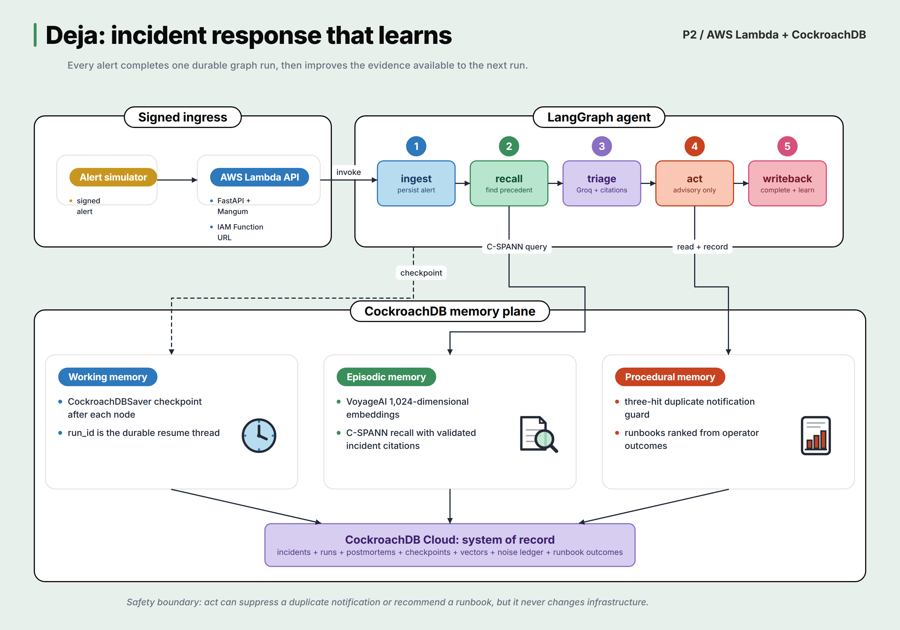

# Deja

Deja is an incident response agent that remembers every run. It diagnoses alerts with Groq,
stores durable LangGraph checkpoints in CockroachDB, recalls prior postmortems through C-SPANN,
tracks repeated alert noise, and ranks runbooks from recorded operator outcomes.

Built for the CockroachDB x AWS Hackathon.

## Architecture



An IAM-signed alert enters the FastAPI service on AWS Lambda, reserves one durable run, queues an
asynchronous self-invocation, and returns HTTP 202. The internal invocation claims a database
lease, loads the latest LangGraph checkpoint, and executes the unfinished graph nodes. The graph
persists the alert, recalls completed precedents, asks Groq for a validated diagnosis, selects an
advisory action, and writes the completed incident back to CockroachDB.

CockroachDB supports three kinds of memory:

- **Working memory:** `CockroachDBSaver` checkpoints every graph node under the run ID, providing
  the durable state needed for retry and resume.
- **Episodic memory:** VoyageAI embeds novel postmortems. C-SPANN retrieves relevant completed
  incidents, and triage may cite only incident IDs returned by that search.
- **Procedural memory:** the noise ledger learns stable duplicate alerts, while runbook outcomes
  produce Laplace-smoothed efficacy scores for later recommendations.

The `act` node remains inside a strict safety boundary. It may suppress a duplicate notification
or recommend a runbook, but it never changes infrastructure and never skips incident processing.

A separate Next.js dashboard reads the operational ledger through a dedicated CockroachDB
principal. That principal has `SELECT` on the nine dashboard tables and no write privileges. The
browser receives only a sanitized snapshot; it never receives a database URL, AWS credential, or
provider key.

## Status

P4 observability, dashboard deployment, and CockroachDB Managed MCP verification completed on
July 26, 2026.

- Real alert-to-postmortem workflow deployed to AWS Lambda in `ap-south-1`
- Public read-only dashboard deployed to Vercel in `bom1`
- Incident feed, node and attempt trace, learning curve, noise ledger, and runbook leaderboard
- Structured JSON logs for alert acceptance, execution boundaries, and every workflow node
- Dashboard database principal is limited to `SELECT` on nine exact tables
- Codex MCP OAuth is scoped to the Deja cluster with read-only permission; a live `select_query`
  returned 37 runs and 34 completed runs
- Browser and snapshot responses contain no database or provider credentials
- IAM-protected Function URL live
- `POST /alerts` reserves stable run identity and returns HTTP 202
- Lambda self-invocation uses asynchronous delivery with two configured retries
- Execution leases reject concurrent duplicate delivery and expire after a timeout
- Attempt records preserve attempt number, status, and checkpoint resume position
- Node effects are first-write-wins by run ID and node name
- Groq triage returns validated JSON
- CockroachDB stores relational run data and all LangGraph checkpoints
- TLS uses `verify-full` with the CockroachDB Cloud root certificate bundled in the image
- Local and live-cloud smoke tests pass
- Completed postmortems are embedded with `voyage-4-lite` at 1,024 dimensions
- C-SPANN recall is constrained by service and alert type
- Triage citations are checked against the incidents returned by recall
- Three stable non-critical, non-escalated observations suppress only duplicate notifications
- Runbooks use Laplace-smoothed efficacy scores from recorded success and failure outcomes
- Lambda runs ECR image `p4-20260726083936`

The live timeout acceptance forced `RUN-591F981A5EDB` to exceed Lambda's 90-second limit before
triage. Attempt 1 expired; AWS retried the same event; attempt 2 resumed from the saved `triage`
checkpoint and completed in 2.966 seconds. The local three-node CockroachDB scene killed node 2
before triage and completed all five graph nodes through the remaining quorum. A final normal
signed Function URL request queued and completed `RUN-E1D6DD5025E8`, proving the non-chaos path
after the warm-runtime regression fix.

The P4 production verification run `RUN-3E482889BBA4` completed all five nodes in 4.334 seconds.
CloudWatch recorded JSON events from `alert.accepted` through `run.execution.finished`. The public
dashboard returned HTTP 200, loaded 37 durable runs, and served a warm snapshot in 0.158 seconds
during acceptance.

## Dashboard

Production: [deja-khaki.vercel.app](https://deja-khaki.vercel.app)

The dashboard is intentionally read-only. It queries CockroachDB from the Next.js server boundary,
auto-refreshes every 30 seconds, and exposes no mutation endpoint.

```sh
cd dashboard
cp .env.example .env.local
# Set DEJA_DATABASE_URL to a read-only CockroachDB connection.
npm install
npm run check
npm run dev
```

Vercel functions are pinned to `bom1` so execution is colocated with the Mumbai CockroachDB
cluster. The global `pg` pool is attached to Vercel's function lifecycle to release idle
connections correctly.

Read-only SQL and Managed MCP evidence are documented in
[`docs/observability/read-only-access.md`](docs/observability/read-only-access.md).

## API

- `GET /health`: process health without touching external services
- `GET /ready`: verifies CockroachDB connectivity
- `POST /alerts`: reserves a run, queues asynchronous execution, and returns HTTP 202
- `GET /runs/{run_id}`: reads the persisted run and postmortem
- `GET /runs/{run_id}/attempts`: reads execution and checkpoint-resume attempts
- `POST /runbooks`: creates an enabled runbook with an initial neutral efficacy score
- `POST /runs/{run_id}/runbook-outcome`: records success or failure for the selected runbook

Example alert:

```json
{
  "service": "payments-api",
  "alert_type": "http-500-spike",
  "severity": "critical",
  "message": "HTTP 500 rate exceeded 18 percent after deploy",
  "labels": {
    "environment": "production",
    "region": "ap-south-1"
  }
}
```

## Local development

Python 3.12 and `uv` are required.

```sh
uv sync --extra dev --python 3.12
cp .env.example .env
```

Set `DATABASE_URL`, `GROQ_API_KEY`, and `VOYAGE_API_KEY` in `.env`, then load them without printing
their values:

```sh
set -a
. ./.env
set +a

.venv/bin/pytest -q
.venv/bin/ruff check .
.venv/bin/python scripts/live_smoke.py
.venv/bin/python scripts/p2_state_acceptance.py
make p3-crdb-node-failure
```

The original P0 experiments remain under `spikes/`:

```sh
.venv/bin/python spikes/s3_checkpoint_resume.py crash
.venv/bin/python spikes/s3_checkpoint_resume.py resume
.venv/bin/python spikes/s3_vectorstore.py
```

## Deploy

The deployment script creates or updates the ECR repository, Lambda execution role, container
function, and IAM-protected Function URL.

```sh
set -a
. ./.env
set +a

AWS_PROFILE=deja AWS_REGION=ap-south-1 ./scripts/deploy.sh
```

Invoke the URL with a signed request:

```sh
.venv/bin/deja-simulate https://FUNCTION_ID.lambda-url.ap-south-1.on.aws \
  --aws-profile deja \
  --aws-region ap-south-1

.venv/bin/python scripts/p2_replay_acceptance.py \
  https://FUNCTION_ID.lambda-url.ap-south-1.on.aws \
  --aws-profile deja \
  --aws-region ap-south-1

# Requires DEJA_CHAOS_ENABLED=true for the acceptance window.
make p3-lambda-timeout
```

## License

MIT
